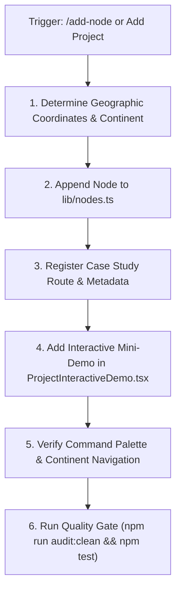

# Add Project Node Runbook (`/add-node`)

This skill standardizes the procedure for adding a new project node to the 3D Earth Portfolio, linking it to orbital coordinates, case study pages, search indexing, and interactive mini-demos.

---

## ⚡ Execution Sequence



---

## 📋 Step-by-Step Procedure

### Step 1: Collect Project Parameters
Ensure all required properties of the `OrbitalNode` interface are defined:
- **`id`**: Unique kebab-case slug (e.g. `flow`, `mastermind`, `ai-agent`).
- **`label`**: Display title (e.g. `Flow`, `MasterMind`).
- **`type`**: `'project'`.
- **`lat` & `lng`**: Geographic coordinates on Earth (e.g. `37.7749`, `-122.4194`).
- **`city` & `country`**: Geographic origin.
- **`continent`**: `'North America' | 'South America' | 'Europe' | 'Africa' | 'Asia' | 'Australia'`.
- **`description`**: Concise 1–2 sentence summary for 3D billboard and Command Palette.
- **`longDescription`**: Comprehensive narrative for `/projects/[id]` case study overview.
- **`keyFeatures`**: Array of 4–6 standout engineering features.
- **`architecture`**: String describing data flows, protocols, and database caching.
- **`metrics`**: Array of `{ label, value, subtext }` KPI objects.
- **`challenges`**: Array of engineering challenges and resolutions.
- **`techCategories`**: Array of `{ category, skills }` grouping frontend, backend, AI, etc.
- **`tech`**: Flat array of main tech tags.
- **`orbitRadius`** (e.g. `3.8`), **`orbitSpeed`** (e.g. `0.35`), **`orbitOffset`**, **`inclination`**.
- **`geometry`**: `'icosahedron' | 'octahedron' | 'tetrahedron' | 'dodecahedron' | 'torus'`.
- **`accentColor`** (e.g. `#38bdf8`) & **`glowColor`**.

### Step 2: Append Node to `lib/nodes.ts`
Open [lib/nodes.ts](file:///d:/3D%20Portfolio/lib/nodes.ts) and add the node to the `NODES` array.

### Step 3: Add Mini-Demo to `components/ui/ProjectInteractiveDemo.tsx`
Open [ProjectInteractiveDemo.tsx](file:///d:/3D%20Portfolio/components/ui/ProjectInteractiveDemo.tsx):
1. Add a new `case '<new-id>':` in the main switch statement.
2. Implement a self-contained, interactive client mini-demo simulating the project's core feature (e.g. an interactive AST graph, a live simulator, or an AI prompt parser).
3. Connect audio feedback triggers (`soundManager.playClick()`, `soundManager.playHover()`).

### Step 4: Verification & Auditing
Run the project verification suite to ensure zero schema defects or broken links:
```bash
# Verify no duplicate IDs or missing fields
node scripts/bug-checker.js
node scripts/redundant-cleaner.js

# Verify TypeScript compilation
npx tsc --noEmit

# Run unit tests
npm test
```
