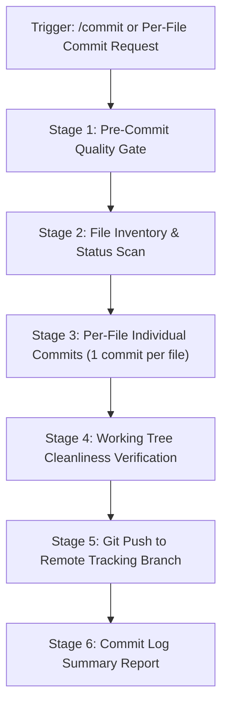

# Atomic Per-File Commit & Push Protocol (`/commit`)

This skill standardizes the **Atomic Per-File Commit Workflow**.
When triggered (e.g. by `/commit`, `commit`, or "commit one file at a time"), each modified, created, or deleted file is staged and committed **individually** with its own tailored Conventional Commit message, followed by pushing all commits to the remote tracking repository.

---

## ⚡ Workflow Sequence



---

## Stage 1: Pre-Commit Quality Gate

Before writing to Git history, verify that code is valid and test suites pass:
```bash
# Verify TypeScript types
npx tsc --noEmit

# Run unit tests
npm test
```
*Requirement*: All checks must pass. If errors exist, resolve them before proceeding.

---

## Stage 2: File Inventory & Status Scan

Identify all modified, untracked, and deleted files:
```bash
git status -s
```

Categorize each file:
- `M`: Modified
- `??` / `A`: Untracked / New
- `D`: Deleted

---

## Stage 3: Atomic Per-File Commits (1 Commit per File)

For **EACH file** in the inventory, execute the following steps in sequence:

1. **Stage exactly that single file**:
   ```bash
   git add <filepath>
   ```

2. **Craft a scoped Conventional Commit message**:
   - `feat(<scope>)`: New component, route, or functionality.
   - `fix(<scope>)`: Bug fix or logic correction.
   - `perf(<scope>)`: WebGL optimization, rendering speedup, or bundle reduction.
   - `refactor(<scope>)`: Code re-architecture without functional change.
   - `docs(<scope>)`: Documentation, comments, or README updates.
   - `test(<scope>)`: Test cases or Vitest updates.
   - `chore(<scope>)`: Dependencies, configs, scripts, or build tools.

3. **Commit the individual file**:
   ```bash
   git commit -m "<type>(<scope>): <concise, file-specific summary of changes>"
   ```

4. **Verify individual staging was cleared**:
   Ensure `git status -s` no longer shows that file as staged.

---

## Stage 4: Working Tree Cleanliness Verification

Verify that no uncommitted changes remain:
```bash
git status -s
```
*Requirement*: Must return empty output (working tree clean).

---

## Stage 5: Git Push to Remote

Push all generated atomic commits to the current tracking branch:
```bash
# Get current branch
git rev-parse --abbrev-ref HEAD

# Push commits
git push origin <current-branch>
```
*Requirement*: Exit code must be 0 and remote branch updated.

---

## Stage 6: Commit Summary Report

Conclude the execution with a structured markdown table summarizing every generated commit:

```markdown
### 🚀 Atomic Commits & Push Summary

| # | Commit SHA | File | Conventional Message |
|---|------------|------|----------------------|
| 1 | `7f8a12b` | `lib/nodes.ts` | `feat(nodes): add new orbital node for interactive showcase` |
| 2 | `3c9d41e` | `components/ui/CommandPalette.tsx` | `refactor(palette): optimize fuzzy search ranking algorithm` |
| 3 | `a9b2c01` | `package.json` | `chore(deps): update vitest to latest patch version` |

**Remote Branch**: `main` (Pushed successfully)
```

---

## 🛠️ Automated Automation Script

For instant execution, use the included helper script:
```powershell
powershell -ExecutionPolicy Bypass -File .agents/skills/commit/scripts/atomic_commit.ps1
```
