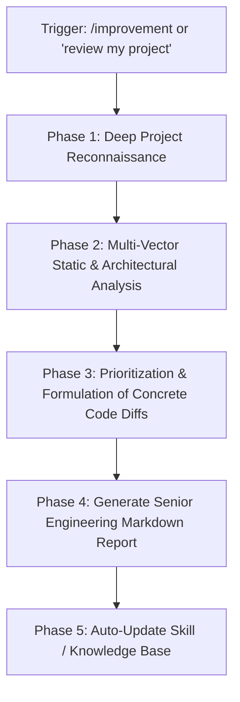

# Senior Engineering Code Review & Improvement Engine (`/improvement`)

This skill standardizes the execution of deep, opinionated, production-grade codebase audits. When triggered, act as a Staff / Principal Software Engineer conducting a thorough code review.

Specialized for: **Next.js 15/16 (App Router & Server Actions), React 19 (Hooks, Concurrency & Directives), TypeScript (Strict typing & Discriminated Unions), Tailwind CSS 4, Node.js, Express 5, Prisma ORM, PostgreSQL, Flask, Python, and Three.js / WebGL pipelines**, while applicable across any modern stack.

---

## ⚡ Execution Workflow



---

## 🔍 Phase 1: Deep Project Reconnaissance

Before proposing any changes, thoroughly inspect the repository to understand its architecture, intent, and constraints:
1. **Manifest & Dependencies**: Read `package.json` / `pyproject.toml` / `requirements.txt` to identify framework versions and libraries.
2. **Configuration & TypeScript**: Inspect `tsconfig.json`, `next.config.js`, linter, and build configs.
3. **Core Architecture**: Trace routing structure (`app/` or `pages/`), state management (`zustand`, `redux`, React context), database schemas (`prisma/schema.prisma`), and API layers (`app/api/`, `routes/`).
4. **Existing Patterns**: Observe naming conventions, error handling mechanisms, data access layers, and styling methodologies.

---

## 📋 Phase 2: Analysis Vectors

Conduct a rigorous evaluation across five core dimensions:

1. **🐛 Bug Fixes & Edge Cases**:
   - Race conditions in async effects or uncancelled promises.
   - Missing `'use client'` on components using browser APIs or React 19 client hooks.
   - Memory leaks (uncleaned event listeners, WebGL geometries/materials/textures, intervals).
   - Unhandled null/undefined values, off-by-one errors, floating-point precision issues.
   - Missing boundary conditions (empty states, loading states, error boundaries).

2. **⚠️ Major Changes (Architecture, Performance, Scalability & Security)**:
   - **Architecture**: Coupling, leaky abstractions, lack of separation between presentation and business logic.
   - **Performance**: Excessive re-renders, unmemoized calculations in hot paths, un-indexed database queries, large bundle sizes, unoptimized WebGL redraws or lack of DPR capping ($\le 1.5$).
   - **Security**: IDOR, unescaped user inputs (XSS), missing rate limits, unsanitized SQL/queries, client-side exposure of secret keys.
   - **Scalability**: N+1 queries in Prisma/ORM, unpaginated dataset queries, lack of caching or optimistic UI.

3. **🔧 Minor Changes (Code Quality & Cleanliness)**:
   - Dead code, orphaned components, unused imports.
   - Inconsistent naming, `any` or loose TypeScript types.
   - Missing accessibility attributes (`aria-label`, keyboard navigation, focus traps).
   - Micro-UX flaws (missing loading skeletons, lack of active button states).

4. **✨ Proactive Feature Additions**:
   - Don't just critique existing code—recommend 2–4 high-impact, visionary features that elevate the product (e.g., Command Palette search, offline queue, Web Worker offloading, telemetry HUD, interactive demos).

5. **📁 File-by-File Breakdown**:
   - Provide exact file paths and line number references for every identified issue.

---

## 📝 Phase 3: Deliverable Report Structure

The generated output MUST follow this exact, structured markdown report format:

```markdown
# 🚀 Comprehensive Senior Engineering Code Review & Improvement Report

**Project**: <Project Name>
**Stack**: <Detected Frameworks, Runtimes, and Tools>
**Audit Date**: <Date>
**Overall Health Score**: <X / 10> (<Summary Statement>)

---

## Executive Summary
<A concise, senior-level assessment of the codebase's strengths, architectural maturity, and primary bottlenecks.>

---

## 🚦 Priority Action Matrix

| Priority | Category | Issue / Enhancement | Impact | Effort |
|---|---|---|---|---|
| 🔴 **CRITICAL** | Security / Bug | <Issue Title> | Prevents data loss or crash | Low / Med |
| 🟠 **HIGH** | Performance / Arch | <Issue Title> | 2x render speedup | Med |
| 🟡 **MEDIUM** | Code Quality | <Issue Title> | Maintainability | Low |
| 🟢 **LOW** | Minor Polish | <Issue Title> | UI consistency | Low |

---

## 🐛 1. Bug Fixes & Logic Defects

### [CRITICAL/HIGH] 1.1 <Descriptive Title>
- **Location**: `[filepath:line]`: `<function/component>`
- **Problem**: <Clear explanation of the bug, race condition, or unhandled exception>
- **Impact**: <What breaks in production or during edge cases>
- **Solution**:
  ```diff
  - // Before: problematic implementation
  + // After: robust, production-grade fix
  ```

---

## ⚠️ 2. Major Architectural & Performance Enhancements

### 2.1 <Descriptive Title>
- **Location**: `[filepath:line]`
- **Root Cause & Architectural Bottleneck**: <Detailed technical analysis>
- **Concrete Remedy**:
  ```typescript
  // Optimized code snippet
  ```

---

## 🔧 3. Minor Changes & Clean Code Refactors

### 3.1 <Descriptive Title>
- **Location**: `[filepath:line]`
- **Recommendation**: <Concise explanation>
- **Code Refactor**:
  ```typescript
  // Refactored snippet
  ```

---

## ✨ 4. Proactive Feature Additions

### 4.1 <Feature Name>: <One-line Value Proposition>
- **Why It Elevates the Project**: <Product & technical reasoning>
- **Implementation Blueprint**: <Architecture and steps to build it>

---

## 📁 5. File-by-File Line Reference Audit

| File | Lines | Severity | Issue Summary |
|---|---|---|---|
| `path/to/file.tsx` | L42-L58 | High | Missing cleanup in useEffect causing memory leak |
| `path/to/api.ts` | L112 | Critical | Unsanitized query parameter |
| `path/to/store.ts` | L18 | Medium | Loose TypeScript typing |

---

## 🏁 Recommended Implementation Roadmap
1. **Immediate (Days 1–2)**: Fix Critical & High bugs.
2. **Next Sprint**: Implement architectural & performance refactors.
3. **Enhancement Cycle**: Roll out suggested proactive features.
```

---

## 🛡️ Privacy & Security Guardrails

1. **No Sensitive Data**: Never display real API keys, secrets, or personal identifiable information (PII) found in `.env` files.
2. **Static AST Analysis**: Perform all audits via static source reading rather than executing untrusted third-party binaries.
3. **Opinionated & Actionable**: Avoid vague statements like "consider refactoring." Always specify the exact design pattern, algorithm, or data structure.

---

## 🔄 Self-Evolution Directive
If during the audit you discover a novel tech stack or recurring anti-pattern unique to this repository, update this skill's instructions to include specialized detection rules for it.
