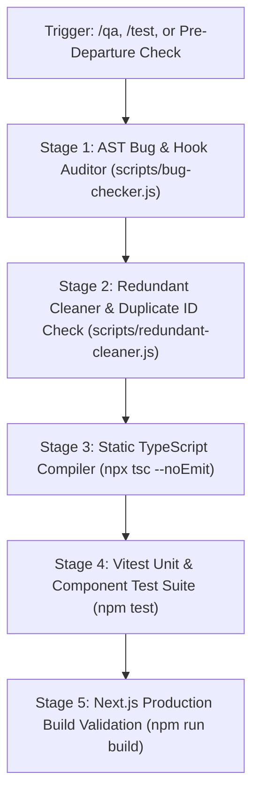

# Automated Quality Gate & Testing Runbook (`/qa`)

This skill standardizes the multi-gate quality assurance pipeline for the 3D Portfolio repository.

---

## ⚡ Execution Pipeline



---

## 📋 Step-by-Step Quality Gates

### Stage 1: AST Bug & Hook Directives Audit
Verifies:
- `lib/nodes.ts` schema integrity.
- All files using React hooks (`useState`, `useEffect`, `useRef`) include `'use client'`.
- No unhandled event listeners or memory leaks in hooks.
```bash
npm run audit:bugs
```

### Stage 2: Orphan Files & Duplicate ID Check
Verifies:
- No orphaned/unused components in `components/`.
- No duplicate node IDs in `lib/nodes.ts`.
```bash
npm run audit:clean
```

### Stage 3: Strict Static TypeScript Validation
Verifies:
- Zero type errors across `app/`, `components/`, and `lib/`.
```bash
npx tsc --noEmit
```

### Stage 4: Vitest Unit & Integration Suites
Runs all unit tests in `tests/`:
```bash
# Run all tests
npm test

# Run tests with coverage
npm run test:coverage
```

### Stage 5: Production Build Verification (Optional / Release)
Ensures static pages pre-render without SSR issues:
```bash
npm run build
```

---

## 🏁 Quality Checklist Summary
Before closing any session or committing code, ensure:
- [ ] `0` AST audit errors
- [ ] `0` duplicate node IDs
- [ ] `0` TypeScript compilation errors
- [ ] `100%` Vitest test suites passing
