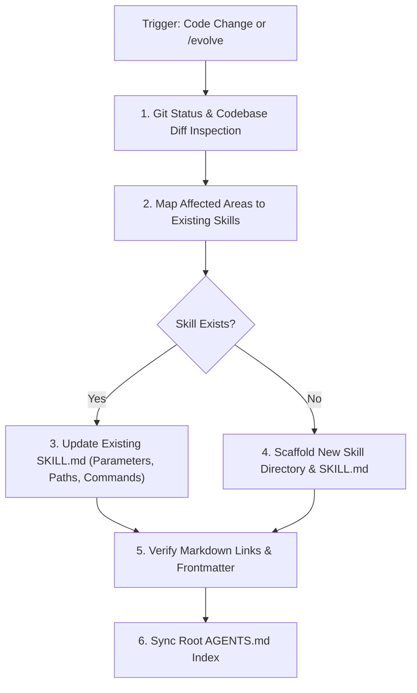

# Autonomous Skill Evolver & Self-Updating Engine (`skill-evolver`)

This meta-skill ensures that Antigravity's knowledge base and runbooks continuously evolve alongside the codebase.

---

## ⚡ Execution Trigger

Execute this skill:
1. **Automatically**: At the conclusion of any task where new files, components, routes, scripts, or dependencies were added or refactored.
2. **On-Demand**: When the user requests `/evolve`, `update skills`, `sync skills`, or asks Antigravity to audit its own capabilities.

---

## 🔄 Self-Evolution Sequence



---

## 📋 Step-by-Step Procedure

### Step 1: Inspect Changes
Run `git status -s` to review changed or newly created files across:
- `components/` (UI, 3D Scene, Providers)
- `app/` (Routes, Layouts, CSS)
- `lib/` (Node data, Math, Audio, State)
- `scripts/` (Auditing, Scaffolding, Cleanup)
- `package.json` (Dependencies, Scripts)

### Step 2: Update Existing Skills
Determine if any existing skill runbook needs refinement:
- **`add-project-node`**: Update if `lib/nodes.ts` `OrbitalNode` schema changes or new fields (e.g. video previews, new tech categories) are added.
- **`webgl-scene-optimizer`**: Update if Three.js shaders, atmosphere altitudes, post-processing passes, or camera rigs are modified.
- **`interactive-demo-builder`**: Update if new interactive mini-demos or simulation patterns are introduced in `components/ui/ProjectInteractiveDemo.tsx`.
- **`sound-fx-synthesis`**: Update if new procedural audio profiles (e.g. click, warp, swoop) or audio nodes are added in `lib/sound.ts`.
- **`qa-audit-test`**: Update if new test scripts, lint rules, or audit scripts are added to `package.json`.
- **`improvement`**: Update if new framework patterns or architectural paradigms are adopted.

### Step 3: Scaffold New Skills When Required
If an entirely new capability or subsystem is introduced (for example: Web Worker Stockfish engine, PWA service workers, WebXR VR mode, or automated screenshot generation):
1. Create directory: `.agents/skills/<new-skill-name>/`
2. Create `SKILL.md` with required YAML frontmatter:
   ```markdown
   ---
   name: <new-skill-name>
   description: >-
     Describe when the agent should use this skill in third-person.
   ---
   ```
3. Provide step-by-step procedures, CLI commands, and verification gates.
4. Register the new skill in the root `AGENTS.md` index.

### Step 4: Verification Gate
- Confirm all file paths use valid markdown link formatting: `[filename](file:///path/to/file)`.
- Confirm YAML frontmatter parses cleanly with `name` and `description`.
