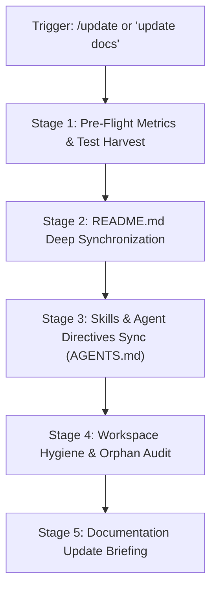

# Documentation & Repository Synchronizer Runbook (`/update`)

This skill standardizes the end-to-end documentation synchronization workflow for the **Interactive 3D Earth Portfolio**.
When triggered (e.g., by `/update`, `update`, `docs`, or `update readme`), execute all stages to ensure zero documentation drift between the active codebase and user-facing documentation.

---

## ⚡ Workflow Sequence



---

## 📋 Step-by-Step Execution Stages

### Stage 1: Pre-Flight Metrics & Test Harvest
Harvest active metrics from the codebase so documentation displays verified, real data:
1. **Run Unit Tests**:
   ```bash
   npm test
   ```
   Record: Number of passing tests (e.g. `43 / 43`), test files (`9`), and duration.
2. **Compile TypeScript**:
   ```bash
   npx tsc --noEmit
   ```
   Confirm `0` compilation errors.
3. **Verify Git History**:
   ```bash
   git status -s
   ```
   Identify recent additions, deletions, and refactors.

---

### Stage 2: `README.md` Deep Synchronization
Open [README.md](file:///d:/3D%20Portfolio/README.md) and audit the following sections against current code:

1. **Features Section**:
   - Verify all interactive capabilities are documented:
     - 3D WebGL Earth Globe with Rayleigh atmospheric scattering
     - Continental Navigation Dock & Vertical Navigation Dots
     - Split-Screen Developer Bio HUD Modal
     - Global Command Palette (`⌘K` / `/`)
     - Procedural Web Audio API Synthesizer Engine
     - **Spatial Geo-Distance & Orbital Compass HUD** (`components/ui/OrbitalCompassHUD.tsx`)
     - **Real-Time Astronomical Day/Night Terminator Lighting**
     - **MasterMind Web Worker Stockfish Evaluation Engine** (`public/workers/chess-eval-worker.js`)
     - Case Study Pre-Rendered Routes (`/projects/[id]`)

2. **Project Architecture & Directory Structure**:
   - Keep the ASCII directory tree 100% accurate:
     - Remove deleted/pruned components (e.g. `NodeLabel.tsx`, `NodePanel.tsx`).
     - Add newly created components (`OrbitalCompassHUD.tsx`, `chess-eval-worker.js`).
     - Reflect newly added test suites (`OrbitalCompassHUD.test.tsx`).

3. **Metrics & Quality Section**:
   - Update test suite metrics (`43 passing tests across 9 test suites`).
   - Confirm dependencies in the Tech Stack table match [package.json](file:///d:/3D%20Portfolio/package.json).

---

### Stage 3: Skills & Agent Directives Sync
1. Open [AGENTS.md](file:///d:/3D%20Portfolio/AGENTS.md):
   - Confirm all skills under `.agents/skills/` are listed in the command triggers table.
   - Verify runbook paths are accurate GitHub markdown links.
2. Audit `.agents/skills/`:
   - Verify no outdated parameters, obsolete file names, or broken relative links exist in any `SKILL.md`.

---

### Stage 4: Workspace Hygiene & Orphan Audit
Run the automated audit scripts:
```bash
npm run audit:bugs
npm run audit:clean
```
- Confirm `0` bugs/warnings.
- Confirm `0` orphan components or duplicate node IDs.

---

### Stage 5: Documentation Update Briefing
Deliver a structured summary report of all synchronized documents:

```markdown
### 📝 Documentation & Repository Sync Complete

- **Updated Documents**:
  - `README.md`: Synchronized features, directory tree, and test metrics
  - `AGENTS.md`: Verified command trigger registry
  - `.agents/skills/`: Audited runbook synchronization
- **Test Metrics Harvest**:
  - Tests: **43 / 43 passing** across 9 test suites
  - TypeScript: **0 errors**
  - Hygiene: **0 orphan files, 0 duplicate IDs**
- **Pending Git Changes**: Ready for atomic commit via `/commit`.
```
